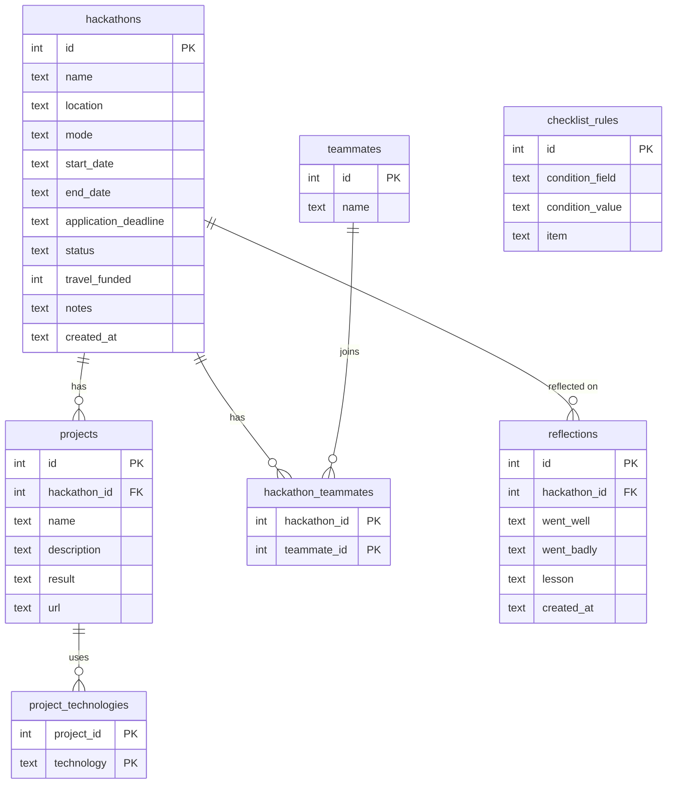

```mermaid
erDiagram
    hackathons ||--o{ projects : "has"
    hackathons ||--o{ hackathon_teammates : "has"
    teammates ||--o{ hackathon_teammates : "joins"
    projects ||--o{ project_technologies : "uses"
    hackathons ||--o{ reflections : "reflected on"

    hackathons {
        int id PK
        text name
        text location
        text mode
        text start_date
        text end_date
        text application_deadline
        text status
        int travel_funded
        text notes
        text created_at
    }
    teammates {
        int id PK
        text name
    }
    hackathon_teammates {
        int hackathon_id PK
        int teammate_id PK
    }
    projects {
        int id PK
        int hackathon_id FK
        text name
        text description
        text result
        text url
    }
    project_technologies {
        int project_id PK
        text technology PK
    }
    reflections {
        int id PK
        int hackathon_id FK
        text went_well
        text went_badly
        text lesson
        text created_at
    }
    checklist_rules {
        int id PK
        text condition_field
        text condition_value
        text item
    }
```

Log domain: hackathons, teammates, hackathon_teammates, projects, project_technologies.
Insights domain: reflections, checklist_rules. The only link between the domains is hackathon_id.